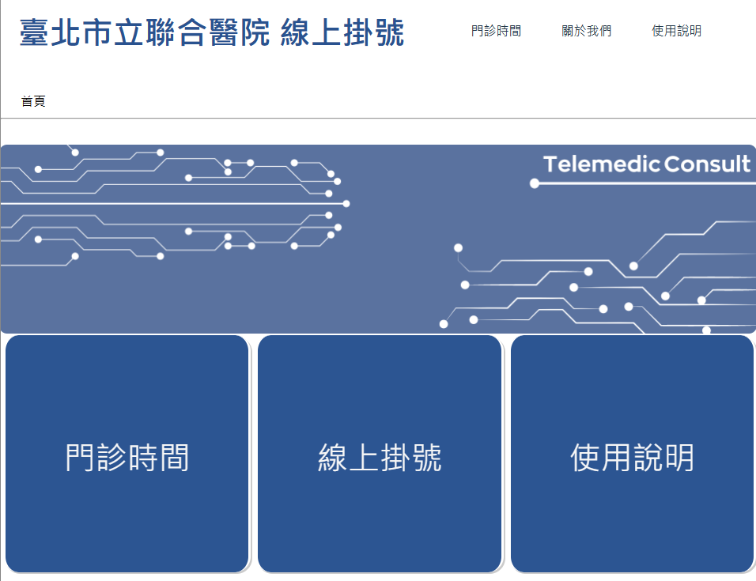
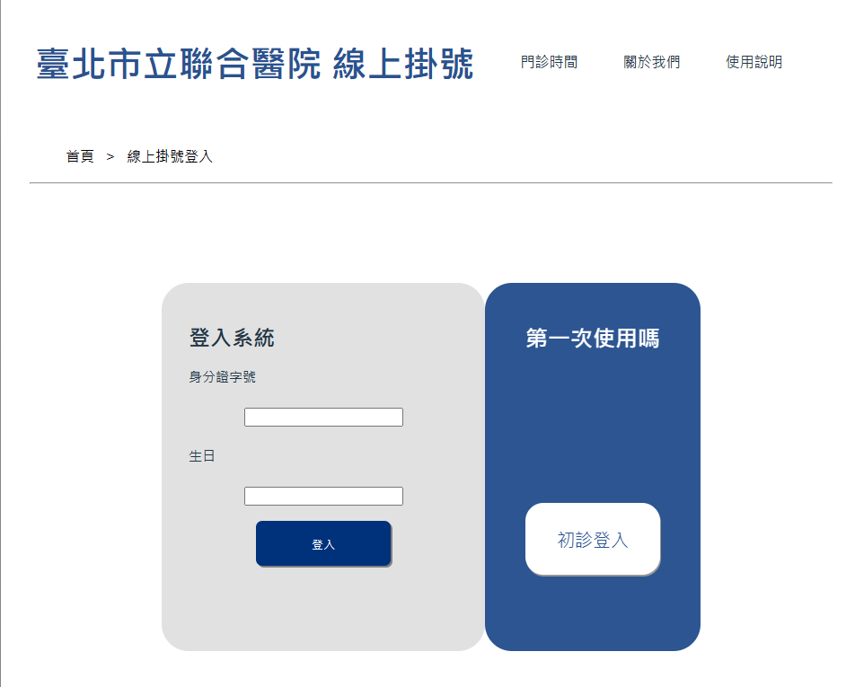
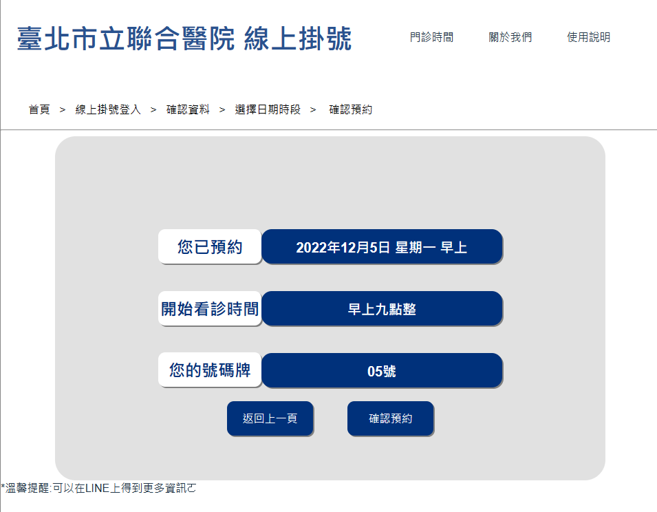
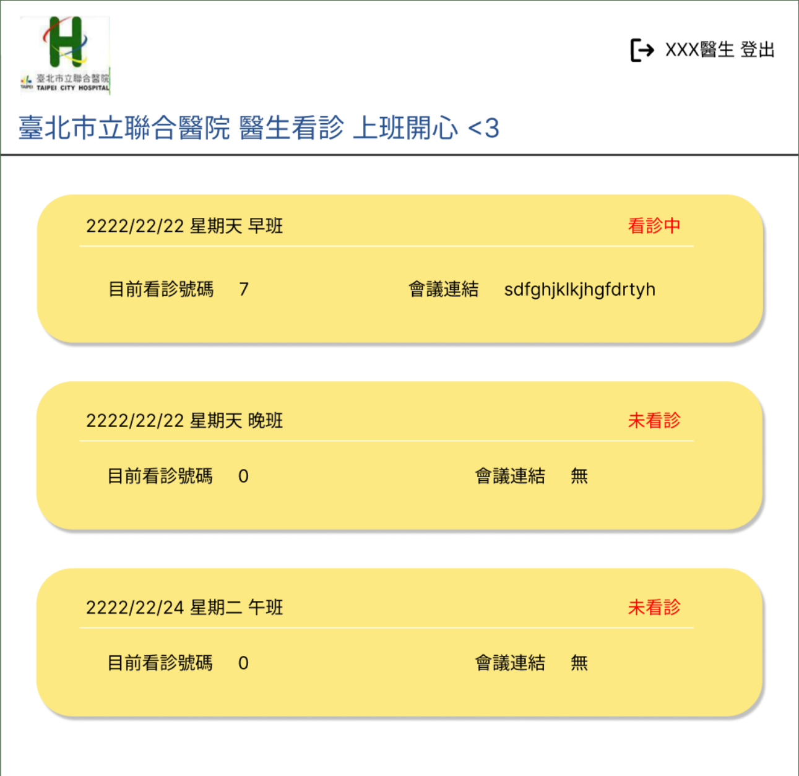
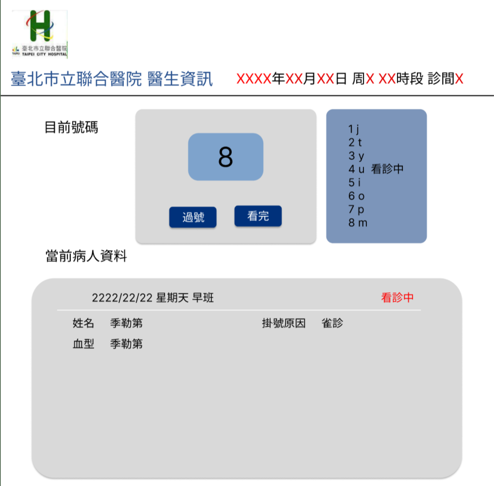

# 通訊診療與個案管理系統 - 前端網頁

📖 [英文版README.md](#TelemedicConsult-Web) 📖

## 本專案提供網站給病人掛號及醫生看診

### 專案簡述

> [通訊診療與個案管理系統-前端網頁](https://github.com/HappyGroupHub/TelemedicConsult-Backend-LineBot)
> 與[後端API及LineBot](https://github.com/HappyGroupHub/TelemedicConsult-Backend-LineBot)為同一專案

因為疫情的緣故，線上診療的需求日漸增加，因此我們計畫設計一個從線上掛號開始，進入會議室看診到最後的個案管理，有一個對所有用戶親民的系統/流程。讓通訊診療不再令人措手不及，院方也可在看診後留下診間及病患的紀錄，家屬時間成本得以捨去。

病人可以透過此網站進行掛號，透過加入Line官方帳號綁定的形式，進而達成使用Line進行通訊診療跟個案管理的服務。考量到Line在台灣為主流的通訊軟體，幾乎人手一台的手機都有安裝Line，這解決了裝置限定與方便性的問題。

而醫生也將擁有專門的看診網站，除了透過傳送Line會議室連結給病人完成看診，醫生也可以輕鬆的在網站上留下備註即進行叫號等工作。

### 專案功能

#### > 一般使用者(病人)

- 首頁提供使用說明/查看門診時間及掛號等功能
- 初診填寫病人基本資料並儲存於資料庫
- 複診病人可透過**身分驗證**直接進入掛號階段
- 完成看診掛號

#### > 醫生

醫生看診網站與普通用戶掛號網站完全分開，登入系統即可使用以下功能:

- 提供工作時段及診間
- 看診前，上傳在LINE的會議室連結
- 看診期間，隨時更新看診進度及留下看診紀錄

(醫生看診網站仍未實作，以上為預計功能，**不代表台北市立聯合醫院**)

#### > 管理者

- 根據醫院提供的班表上傳可看診的日期時段

---

## 如何使用

### 系統需求

- CPU: 64位元之四核心以上處理器, 基頻2.2Ghz以上
- RAM: 需至少4GB以上
- 作業系統: Windows 8或macOS 10.14以上之版本

### 開發環境與IDE

- 網頁前端開發: JetBrains PhpStorm 2022.2.3
- 網頁前端JS環境: NodeJs v18.15.0 LTS
- 後端與Line機器人: JetBrains PyCharm Community Edition 2022.1.3

### 部署相關軟體

- XAMPP v7.4.33 or above
- MySQL based MariaDB v10.4.25
- Apache v2.4.54
- phpMyAdmin v5.2.0

### 安裝程序

- 依照官網指示完成下載安裝[PhpStorm](https://www.jetbrains.com/phpstorm/)
- 依照官網指示完成下載安裝[PyCharm Community Edition](https://www.jetbrains.com/pycharm/)
- 依照官網指示完成下載安裝[XAMPP](https://www.apachefriends.org/zh_tw/download.html)
    - 勾選Apache服務
    - 勾選MySQL服務
    - 勾選PHP語言
- 依照官網指示完成下載[ngrok](https://ngrok.com/)

### 操作程序

1. 資料庫SQL
    1. 打開xampp並開啟Apache及MySQL服務
    2. 建立一個名為`telemedic_consult_sys`的資料庫
    3. 參考第六節、檔案/資料庫設計，建立相對應的資料表及欄位
2. 前端網頁開發及部署
    1. 使用PhpStorm將程式原始碼clone至指定位置`C:\xampp\htdocs`
    2. 在此資料夾新增檔案`config.json`，並填入相關資料庫連接資訊
    3. 在指令端輸入`yarn dev`
    4. 即可開始進行測試/使用
3. 後端網頁開發及部署
    -
    請至 [通訊診療與個案管理系統 - 後端API及LineBot](https://github.com/HappyGroupHub/TelemedicConsult-Backend-LineBot)
    查看
4. Line機器人開發及部署
    -
    請至 [通訊診療與個案管理系統 - 後端API及LineBot](https://github.com/HappyGroupHub/TelemedicConsult-Backend-LineBot)
    查看

---

## 協助專案開發

### 如何貢獻

1. Fork 這個專案
2. 複製你剛剛 Fork 的專案至本地
3. 建立新的分支
4. 盡情發揮你的能力
5. Commit / Push 你的程式碼
6. 建立新的 Pull Request
7. 等待回覆

### 程式碼撰寫/提交規範

* 每行不超過100個字元
* 使用 `snake_case` 命名變數及函式
* 在檔案尾處加上一個空行
* 最佳化程式碼並移除不必要的import
* 提交請求時請使用以下格式，並全英文撰寫
    - Update - your commit messages here
    - Fix bug - your commit messages here
    - Optimize - your commit messages here
    - Standardize - your commit messages here

### 建議/問題回報

如果你有任何建議或是發現了任何問題，請在 [Issues](https://github.com/HappyGroupHub/TelemedicConsult-Web/issues)
提交你的意見，我會盡快回覆你!

### 開發工具/函式庫

- Figma - 用來設計網頁的UI/UX
- Vue.js - 前端網頁JavaScript框架
- Vite - JavaScript前端整合框架
- Axios - 前端與後端的溝通工具

---

# TelemedicConsult-Web

📖 [繁體中文版README.md](#通訊診療與個案管理系統-前端網頁) 📖

Not yet supported...